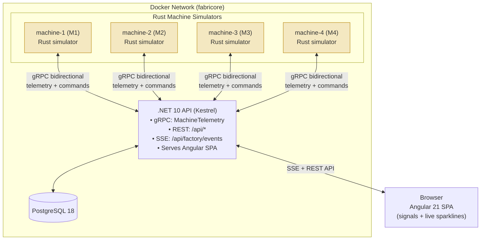

# Fabricore

**A realistic demo of a distributed factory control system.**

Rust-based machine simulators stream live telemetry over gRPC to a .NET Core backend. The backend orchestrates a 4-stage part production line, persists everything to PostgreSQL, and pushes updates in real time to an Angular dashboard (AI-generated) for monitoring and control.

Designed as a self-contained demo of edge-to-cloud industrial patterns: reliable bidirectional streaming, command & control, part traceability, live observability, and clean separation between simulation, application logic, and UI.

---

## Quick Start

```bash
# One-time setup (network + volume are external by design)
docker network create fabricore
docker volume create fabricore-postgres

# Run everything (builds images, starts 4 machines + API + Postgres)
docker compose --env-file .env up --build
```

Open **http://localhost:8000**

You should see 4 machine cards updating live. Click any card to open the control drawer and issue commands (Pause, Resume, Emergency Stop, Cool Down, Inject Defect, Adjust Sim Speed).

Stop with `Ctrl+C`. Useful commands:

```bash
docker compose logs -f web          # backend + gRPC + SPA logs
docker compose logs -f machine-1    # Rust simulator 1 (M1 spawns parts)
./reset_db.sh                       # destroy + recreate postgres volume
```

To fully reset the database:

```bash
./reset_db.sh
```

---

## Architecture



### Data Flow Highlights

- **Telemetry**: Each machine opens a long-lived gRPC stream and pushes `TelemetryMessage` every ~3s (configurable). The server batches inserts and immediately broadcasts to all connected dashboard clients via SSE.
- **Commands**: `POST /api/commands` or internal handoff logic creates a `MachineCommand`, persists it, then tries to push it down the open gRPC stream for that machine (best-effort; always persisted). Machines execute locally and continue streaming.
- **Part Pipeline** (the "core" demo behavior):
  - M1 (source) generates `PART-1xxx` when idle and running.
  - On part completion (any machine), server detects via telemetry and dispatches `ASSIGN_PART` to the next machine in line.
  - M4 (final) marks the part `finished_on` in the DB and emits a `PartProduced` event.
- **Simulation Physics** (in Rust):
  - Sensors (temp, vibration, spindle load, quality) continuously drift toward realistic targets based on run state, part phase, load, and active events.
  - Random overheat events, quality penalties for high temp/vibration.
  - Commands mutate state instantly: `EMERGENCY_STOP` clears part + forces cooldown, `INJECT_DEFECT` drops quality and quarantines current part, `ADJUST_SPEED` changes sim rate or target load, etc.
  - `SIM_SPEED` multiplier lets you fast-forward the entire line for demos.

All containers run read-only with non-root users. The Rust machines auto-reconnect with exponential backoff.

---

## Tech Stack

| Layer         | Technology                          | Notes |
|---------------|-------------------------------------|-------|
| Simulators    | Rust 1.96 + Tokio + Tonic           | Realistic physics, zero external deps at runtime |
| Backend       | .NET 10 (ASP.NET Core)              | gRPC + Controllers + static files |
| Persistence   | PostgreSQL 18 (alpine) + DbUp       | Embedded `.psql` migrations, JSONB for command params |
| Frontend      | Angular 21 (signals, standalone)    | SSE client, SVG sparklines, no polling |
| Transport     | gRPC (protobuf) + SSE               | Bidirectional streaming for machines; simple push for UI |
| Orchestration | Docker Compose                      | 6 services, external net/volume for easy reset |
| Architecture  | Clean (Domain / App / Infra / Api)  | Interfaces for testability, thin controllers |

---

## Key Features (Demo-Friendly)

- **Live command & control** — Pause, resume, emergency stop, cool-down, inject simulated defect (for quality failure demo), adjust simulation speed or spindle load target. Commands appear instantly in the UI command log and are marked executed when delivered.
- **End-to-end part traceability** — Every part is recorded on first telemetry, moved through the line via server-orchestrated handoffs, and finalized with start/finish timestamps.
- **Rich observability** — Per-machine status pills, metrics, quality bars, and two live sparklines (temp + quality, last ~48 samples). Header tally counts machines by state.
- **Resilient streaming** — Machines survive backend restarts; UI auto-resyncs on reconnect.
- **Configurable realism** — Environment variables control cycle time, telemetry rate, and global sim speed per machine.
- **Production-ish hygiene** — Read-only FS, dropped capabilities via non-root, healthchecks on Postgres, batched writes, bounded channels (drop-oldest on backpressure).

---

## Project Layout

```
fabricore/
├── docker-compose.yml      # 4 machines + web + postgres
├── .env                    # POSTGRES_* + connection string
├── reset_db.sh             # Blow away the postgres volume
├── proto/
│   └── comms.proto         # Single source of truth for the gRPC contract
├── machine/                # Rust edge simulator
│   ├── src/
│   │   ├── main.rs         # Reconnect loop + spawned telemetry/part tasks
│   │   ├── state.rs        # RunState, PartPhase, command execution, telemetry builder
│   │   ├── simulation.rs   # Drift math, random events, quality model
│   │   └── config.rs
│   └── Dockerfile
├── api/                    # .NET 10 solution (Fabricore.slnx)
│   ├── Domain/             # Pure models + MachineCommandType enum + ToCode helpers
│   ├── App/                # Use-cases, services, abstractions (ITelemetryService, etc.)
│   ├── Infra/              # Postgres impls, DbUp migrations, queries, repositories
│   ├── Api/                # ASP.NET entrypoint, controllers, gRPC service, SSE broadcaster, dispatcher
│   └── Dockerfile (multi-stage: node build of web → dotnet publish → runtime)
└── web/                    # Angular 21 SPA (served from API wwwroot in prod)
    └── src/app/factory/    # Machine cards, command drawer, SSE service, SVG sparklines
```

**Note on the `web/` directory:** The entire Angular frontend was generated by AI. A nice GUI was not a focus of this project, therefore letting AI generate the Angular project saved significant time and effort on what is a very trivial piece of the work.

The .NET code follows Clean Architecture (Domain → App → Infra → Api) with the dependency rule. Inside the App layer, related code is grouped by feature (Commands, Telemetry, Parts, Factory) rather than by technical role — a lightweight vertical slice influence that keeps each use case's logic and data shapes close together. Controllers are kept deliberately thin.

---

## REST API (selected)

- `GET /api/factory/state` — Full snapshot (machines + recent telemetry/commands + available command list + latest parts)
- `GET /api/factory/events` — SSE stream (`event: Telemetry` / `event: Command`)
- `POST /api/commands` — `{ "MachineId": "M2", "Type": 0, "Parameters": { ... } }` (Type is the enum numeric)
- `GET /api/parts/{partId}/logs` — Part history (currently thin; future audit trail)

gRPC is intentionally not exposed outside the compose network (only the dashboard port 8000 is published).

---

## gRPC Contract (proto/comms.proto)

```proto
service MachineTelemetry {
  rpc TelemetryStream(stream TelemetryMessage) returns (stream CommandMessage);
}

message TelemetryMessage {
  string machine_id;
  string part_id;
  int64  timestamp_ms;
  float  temperature;      // °C
  float  vibration;        // mm/s
  float  spindle_load;     // %
  float  cycle_time_sec;
  float  quality_score;    // 0-100
  string status;           // processing | idle | paused | fault | stopped
  string current_part_status;
}

message CommandMessage {
  string command_id;
  string command_type;     // PAUSE | RESUME | EMERGENCY_STOP | ADJUST_SPEED | COOL_DOWN | INJECT_DEFECT | ASSIGN_PART
  map<string, string> parameters;
  int64  timestamp_ms;
}
```

The stream is long-lived; the server can push commands at any time while the client is connected.

---

## Environment & Configuration

See `.env` for the Postgres values used by compose.

Machine behavior is controlled per-container via:

- `MACHINE_ID` (M1–M4; M1 is the part source)
- `SIM_SPEED`, `PART_CYCLE_BASE_MS`, `TELEMETRY_INTERVAL_MS`
- `BACKEND_GRPC_URL` (defaults to the compose service name)

The .NET side reads `RecordStore__ConnectionString` (double-underscore for nested config).

---

## Why This Stack?

- **Rust at the edge** — Small, fast, reliable.
- **gRPC streaming** — Efficient binary protocol + native support for the exact telemetry-in / commands-out pattern used on real floors.
- **.NET backend** — Mature gRPC + easy to serve a modern SPA from the same process. Strong typing across the domain.
- **Postgres** — Simple, reliable, excellent for time-series-ish workloads.
- **Angular signals + SSE** — Zero-dependency live UI that feels native without websockets complexity.

Everything is runnable on a laptop with one command, yet the boundaries are realistic enough to discuss scaling, auth, multi-tenancy, or PLC integration.

---

## Development Tips

- Angular dev server (separate): `cd web && pnpm install && pnpm start` (talks to `http://localhost:8000`).
- .NET: `dotnet run` from `api/Api` after setting the connection string (migrations run on startup).
- Rust machine binary can be run directly: `MACHINE_ID=M2 BACKEND_GRPC_URL=http://... cargo run`.
- To add a new command: extend the enum in Domain, the match in Rust state, the available list (if user-facing), and the UI meta.
- Migrations live as `*.psql` files in `Infra/RecordStore/Migrations/` and are embedded by DbUp.

---

## License / Status

Personal demo project. Not production code, but intentionally written with real architectural boundaries so it can be extended.